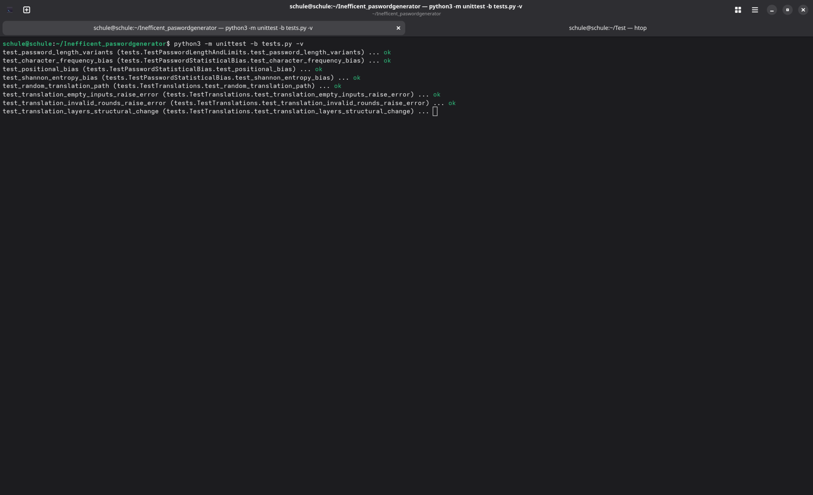
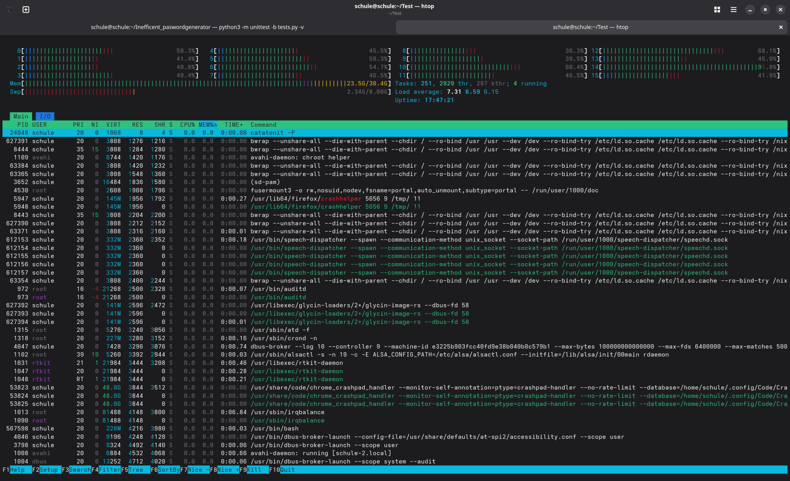
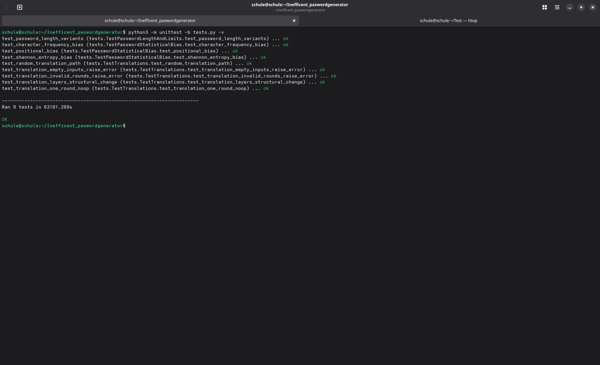
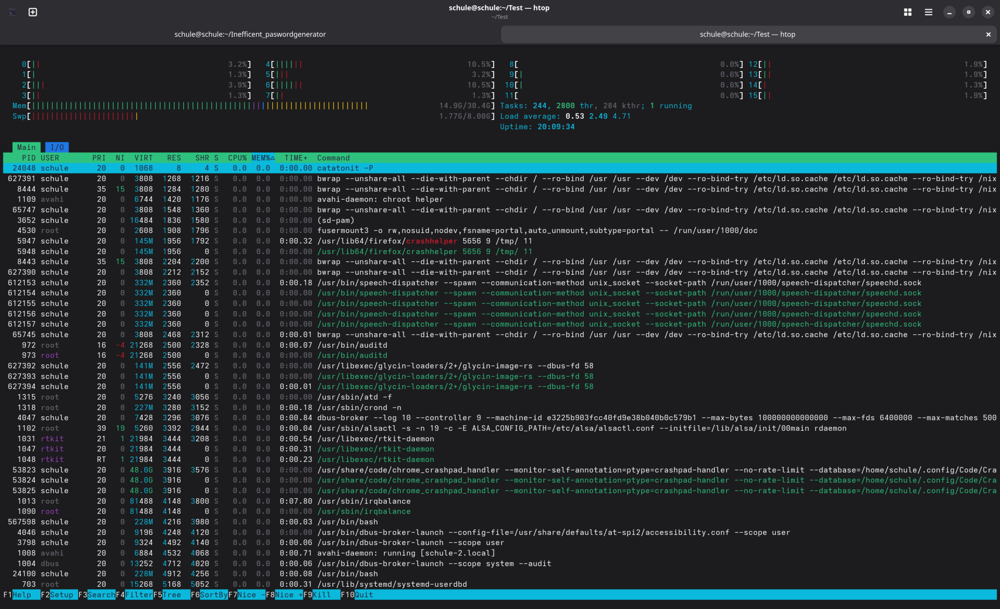
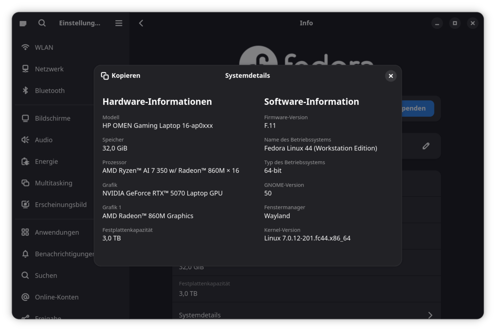

# The Most Inefficient Password Generator

A totally necessary, venture-capital-baiting, and buzzword-packed password generator slapped on top of a local Large Language Model (or "chatbot", if we are being honest) to maximize corporate synergy and linguistic disruption.

Instead of using traditional, lightweight, and boringly proven-to-be-secure random number generators that complete the task in microseconds without consuming two weeks' worth of electricity for an average PC user per password, this project leverages local AI translation loops (the "Telephone Game") to burn CPU and GPU cycles and extract password entropy from pure AI confusion.

I built it in the desperate hope that the non-existent stock price of my non-existent company will skyrocket just because I can say I created a password generator that truly uses AI - assuming I'm not already too late for the hype train.

Are the generated passwords secure? I have no idea - I'm not a security researcher and testing for a high enough entropy and rule out any biases needed too much time for me before pushing it into the main branch. But what I do know is that I have an AI-powered password generator, which means investors will flock to my non-existent company anyway. So frankly, I don't care.

## ***⚠️ IMPORTANT — DO NOT USE THIS FOR REAL PASSWORDS***
This generator is completely unverified and must be considered entirely unsafe until it has been independently analyzed and mathematicaly proven secure by multiple, independent IT-Security Researchers and/or Mathematics. As it stands, it relies on Python's random module (a non-cryptographic Mersenne-Twister PRNG) seeded with time-based values for the final character selection — meaning the output is, in principle, reproducible by anyone who can guess the seed. No amount of mathematical "chaos" upstream fixes this lack of cryptographic safety.

This is a satire project about AI hype, not a security tool. For actual passwords, use secrets (Python), a vetted password manager, or any other audited generator.

---

## 💡 How It Works (The Chaos Pipeline)

The generation pipeline relies entirely on turning a coherent piece of text into absolute structural nonsense, then feeding that nonsense into a custom mathematical engine to extract high-entropy character strings.

```
[User Seeds] ──> [LLM Generates Story] ──> [Multi-Round Random Translation Chaos]
│
[Secure Password] <── [Custom Entropy Math Engine] <───────┘
```

1. **The Core Story:** The system prompts a local AI model (`gemma4:12b` or similar) to write an original, cohesive story based on a user-selected **Genre** and **5 unique keywords**.
2. **Linguistic Decay (The Telephone Game):** The script loops through a user-defined number of rounds (default: 40). In each round, it picks a completely random global language (from a pool of 60+ structurally unique languages like Zulu, Basque, Japanese, or Icelandic) and forces the AI to translate the previous text.
3. **The Loss of Information:** Because different language families use vastly different grammars, semantic drift sets in rapidly. Text gets dropped, replaced, or heavily distorted.
4. **Mathematical Distillation:** The chaotic, final text mutated string is iterated character-by-character. The system reads the ASCII numerical values (`ord`) of adjacent characters, compounds them with the user's initial genre/word selections, and passes them through volatile polynomial algorithms to continuously re-seed a pseudorandom character picker.

---

## 🛠️ Project Structure

The project is split into four modular Python scripts:

| File | Purpose | Key Variables Documented |
| :--- | :--- | :--- |
| **`main.py`** | The orchestration script. Handles the CLI menu loop, gathers user configurations, tracks performance runtimes, and triggers execution. | `output_choice`, `translations_rounds`, `start`, `end` |
| **`story.py`** | Houses the configuration constants (supported languages list, genre dictionary) and the core narrative generation framework. | `MODEL`, `LANGUAGES`, `GENRE`, `prompt` |
| **`translationchaos.py`** | Manages communication with Ollama. Enforces strict JSON/output formatting and provides safeguarding features if the AI returns an empty string. | `text`, `output_language`, `new_text`, `given_language` |
| **`passwordgenerator.py`** | The entropy engine. Contains the validation loop for password size and the multi-layered polynomial math formulas used to distill characters. | `number`, `length_of_password`, `translated_story` |

---

## 🚀 Prerequisites & Installation

### 1. Install Ollama
Since this project requires local inference, you must have **Ollama** installed on your system.
* Download it from [ollama.com](https://ollama.com)

### 2. Download the Model
By default, the project uses a robust multilingual training corpus. Open your terminal and run your target model (without changing anything in the programm it is the model `gemma4:12b`):
```bash
ollama run gemma4:12b
```

⚠️ Hardware Note: If your machine lacks a dedicated GPU that has less than 8GB of VRAM, less than 32GB of RAM and 8GB of SWAP, you can change the MODEL variable inside story.py to a smaller alternative (e.g., phi3 or llama3:8b). Avoid models smaller than 7B parameter sizes, as they tend to "forget" the strict translation constraints and output conversational filler, or get stuck in a never endig loop.

## 3. Install Python Dependencies

The project requirements are split into core execution dependencies and optional testing tools.

### Core Dependencies

Required for the story generation, translation loop, and the password generator:
```bash
pip3 install ollama psutil --user
```

### Testing Dependencies (Optional)

Required only if you want to run the unit tests and analyze the password entropy or bias footprint:
```bash
pip3 install scipy --user
```

## 🎮 Usage

Run the master script directly from your terminal:
```bash
python3 main.py
```

Run the unit tests directly from your terminal (this will suppress the regular output of the functions):
```bash
python3 -m unittest -b tests.py -v
```

### Execution Steps:
* Choose Password Length: Specify the target length (minimum 10, default 20).
  * Select Mode:
    * [1] Story: Prints out the step-by-step intermediate translation logs so you can visibly watch the story break down across random global languages before seeing a final translation.
    * [2] Password: Quietly calculates the algorithms behind the scenes and returns only your final secure string.
  * Input Words & Genre: Give the AI 5 words and a narrative style to begin the baseline tracking matrix.
  * Set Translation Rounds: Input how many times the story should jump languages (e.g., 40).

## 📊 Performance & System Load

While modern cryptographic infrastructure values speed and proven security, this system deliberately spins up billions of mathematical matrix multiplications across your computer hardware over dozens of full neural-network inference cycles.

Depending on your hardware architecture (CPU vs. GPU plus the generation of it), your translation loop settings, and chosen model, generating a single password may take anywhere from a few minutes to several hours, maybe even days, but the upper limits aren't tested yet. It provides a completely unique, unpredictable entropy footprint born from AI cognitive degradation—at the cost of traditional computing efficiency.

### Hardware Footprint While and After Running tests.py

While running the test (ran on the night from the 19th of June to the 20th of June, started on the afternoon of the 19th of June):



After the test:



The system the test was running:
